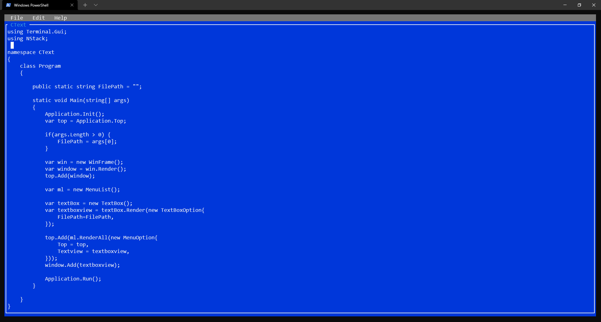

# CText
Console Based Text Editor written in **DotNet**.

It uses **[Terminal.Gui](https://github.com/migueldeicaza/gui.cs)** for the UI.



> DotNet SDK required !!

Target Framework: **net5.0**

### Usage
```shell
git clone https://github.com/soubikbhuiwk007/CText
cd CText
dotnet run
```

**[Full Documentation](doc/Readme.md)**

### License
**[MIT](LICENSE)**