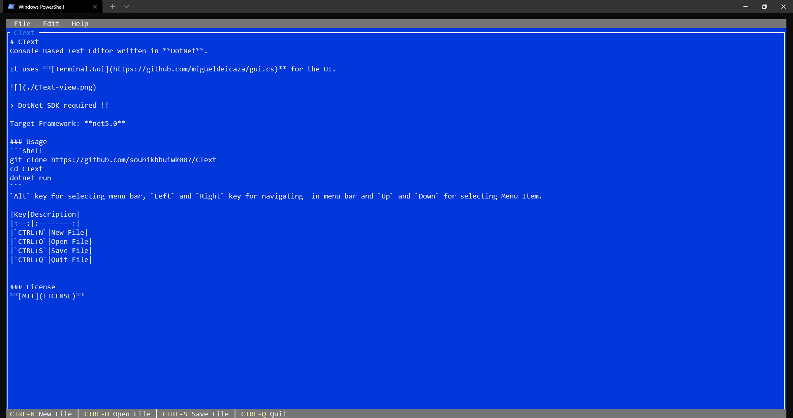

# CText
Console Based Text Editor written in **DotNet**.

It uses **[Terminal.Gui](https://github.com/migueldeicaza/gui.cs)** for the UI.



> DotNet SDK required !!

Target Framework: **net5.0**

### Usage
```shell
git clone https://github.com/soubikbhuiwk007/CText
cd CText
dotnet run
```
`Alt` key for selecting menu bar, `Left` and `Right` key for navigating  in menu bar and `Up` and `Down` for selecting Menu Item.

To open a file from command line: run the project with the file name as argument `dotnet run <file-name>`

### Key Bindings
|Key|Description|
|:--:|:--------:|
|`CTRL+N`|New File|
|`CTRL+O`|Open File|
|`CTRL+S`|Save File|
|`CTRL+Q`|Quit File|


### License
**[MIT](LICENSE)**
